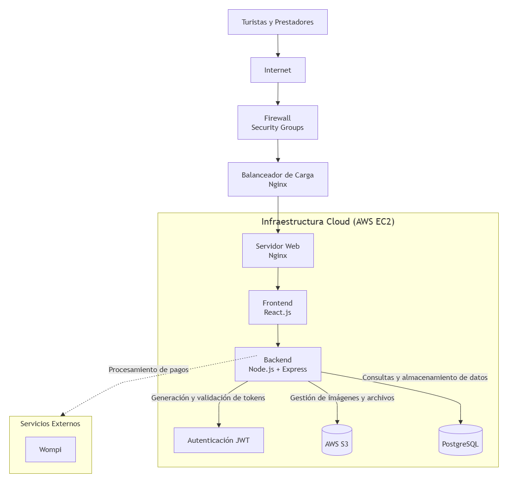
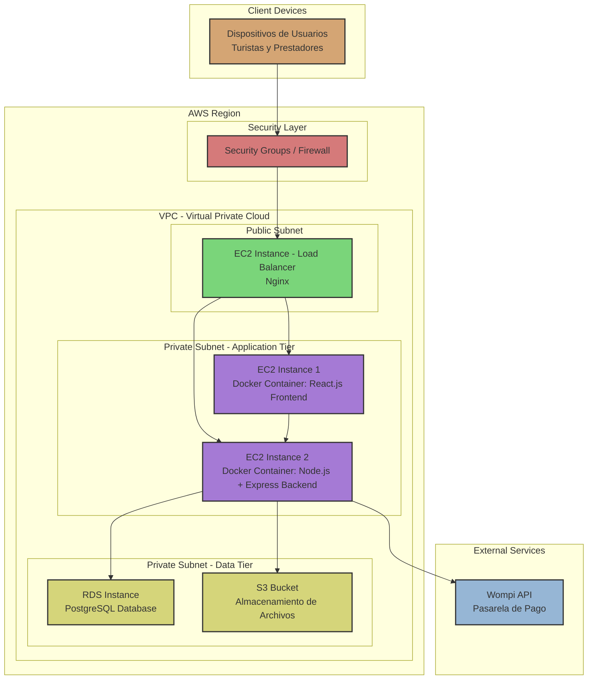

# Punto 1 — Catálogo Tecnológico

## Componentes tecnológicos de la solución

| Componente | Función | Tecnología seleccionada |
|------------|----------|-------------------------|
| **Frontend** | Interfaz web utilizada por turistas y prestadores de servicios. | React.js |
| **Backend** | Gestiona la lógica del negocio y la comunicación entre componentes. | Node.js + Express |
| **Base de Datos** | Almacena información de usuarios, prestadores, servicios y reservas. | PostgreSQL |
| **Servidor Web** | Publica la aplicación y gestiona las solicitudes HTTP. | Nginx |
| **Firewall** | Protege la infraestructura frente a accesos no autorizados. | Firewall Cloud / Security Groups |
| **Balanceador de Carga** | Distribuye las solicitudes de los usuarios entre los servicios disponibles. | Nginx Load Balancer |
| **Infraestructura Cloud** | Aloja los servicios y permite el crecimiento de la plataforma. | AWS EC2 |
| **Almacenamiento** | Guarda imágenes y archivos relacionados con los servicios turísticos. | AWS S3 |
| **Autenticación** | Gestiona el acceso seguro de los usuarios. | JWT |
| **Pasarela de Pago** | Procesa las transacciones realizadas por los usuarios. | Wompi |

# Punto 2 – Diagrama Tecnológico

## Diagrama Tecnológico

## Explicación del Diagrama

Los turistas y prestadores de servicios acceden a la plataforma a través de Internet. Antes de llegar a la aplicación, las solicitudes pasan por un firewall que ayuda a proteger el sistema contra accesos no autorizados.

Posteriormente, un balanceador de carga basado en Nginx distribuye las solicitudes para mejorar el rendimiento y la disponibilidad de la plataforma.

Dentro de la infraestructura cloud de AWS EC2 se encuentran los principales componentes de la solución: el servidor web Nginx, el frontend desarrollado en React.js y el backend implementado con Node.js y Express.

El backend se encarga de procesar la lógica de negocio y se comunica con PostgreSQL para almacenar la información de usuarios, servicios y reservas. Además, utiliza AWS S3 para almacenar imágenes y archivos relacionados con los servicios turísticos.

La autenticación de los usuarios se realiza mediante JWT, mientras que los pagos son procesados a través de la pasarela de pago Wompi.

# Punto 3 – Diagrama de Despliegue

## Diagrama de Despliegue

## Explicación

### Dispositivos de Usuarios
Los turistas y prestadores de servicios acceden a la plataforma a través de sus dispositivos (navegadores web, aplicaciones móviles) conectados a Internet.

### Capa de Seguridad
Las solicitudes de los usuarios pasan primero por Security Groups/Firewall que filtra el tráfico no autorizado antes de entrar a la VPC de AWS.

### AWS Region - VPC Architecture
La infraestructura se despliega en una VPC (Virtual Private Cloud) de AWS con la siguiente distribución:

#### Public Subnet
- **EC2 Instance - Load Balancer**: Instancia de EC2 con Nginx como balanceador de carga que distribuye el tráfico entrante hacia las capas de aplicación.

#### Private Subnet - Application Tier
- **EC2 Instance 1**: Ejecuta un contenedor Docker con el Frontend React.js
- **EC2 Instance 2**: Ejecuta un contenedor Docker con el Backend Node.js + Express

El uso de contenedores Docker facilita el despliegue, escalado y aislamiento de las aplicaciones.

#### Private Subnet - Data Tier
- **RDS Instance**: Instancia gestionada de PostgreSQL para almacenamiento de datos de usuarios, servicios y reservas
- **S3 Bucket**: Servicio de almacenamiento de objetos para imágenes y archivos relacionados con servicios turísticos

### Servicios Externos
- **Wompi API**: Pasarela de pago externa para procesar transacciones de manera segura

# Punto 4 — Justificación de las Decisiones Tecnológicas

## Descripción

La arquitectura tecnológica propuesta para **Sucre TravelTech S.A.S.** fue diseñada para soportar los procesos y capacidades de negocio definidos en las fases anteriores de la Arquitectura Empresarial. La selección de cada componente busca garantizar una solución segura, escalable y alineada con las necesidades de la plataforma turística.

## Justificación de las Tecnologías Utilizadas

### React.js (Frontend)
Se seleccionó **React.js** para el desarrollo de la interfaz de usuario debido a que permite crear aplicaciones web dinámicas, intuitivas y reutilizables. Esto facilita que turistas y prestadores de servicios interactúen con la plataforma de forma sencilla y mejora la experiencia de navegación.

### Node.js + Express (Backend)
El **Backend** se implementa con **Node.js y Express** porque ofrecen un entorno eficiente para desarrollar servicios web y APIs REST. Esta tecnología permite gestionar la lógica del negocio, el procesamiento de reservas, la autenticación de usuarios y la integración con servicios externos como la pasarela de pago.

### PostgreSQL (Base de Datos)
Se utiliza **PostgreSQL** como sistema gestor de bases de datos debido a su estabilidad, seguridad y capacidad para manejar transacciones. Este componente almacena la información relacionada con usuarios, prestadores, servicios turísticos, reservas y pagos, garantizando la integridad de los datos.

### Nginx (Servidor Web y Balanceador de Carga)
**Nginx** cumple dos funciones dentro de la arquitectura:
- Como **servidor web**, se encarga de atender las solicitudes de los usuarios y servir la aplicación.
- Como **balanceador de carga**, distribuye el tráfico entre los servicios disponibles, mejorando el rendimiento y la disponibilidad de la plataforma.

### AWS EC2 (Infraestructura Cloud)
La infraestructura se despliega sobre **AWS EC2**, ya que proporciona un entorno flexible y escalable para alojar la aplicación. Esta solución permite aumentar la capacidad de procesamiento conforme crezca el número de usuarios y prestadores registrados en la plataforma.

### AWS S3 (Almacenamiento)
El servicio **AWS S3** se utiliza para almacenar imágenes, documentos y archivos relacionados con los servicios turísticos. Esta alternativa evita sobrecargar la base de datos y ofrece un almacenamiento seguro, disponible y de alta durabilidad.

### JWT (Autenticación)
La autenticación mediante **JSON Web Token (JWT)** permite implementar un mecanismo seguro de identificación y autorización de usuarios. Gracias a esta tecnología, el sistema puede validar el acceso a las funcionalidades de la plataforma sin comprometer la seguridad de la información.

### Wompi (Pasarela de Pago)
Se eligió **Wompi** como pasarela de pago porque ofrece una integración sencilla con aplicaciones web y permite procesar pagos electrónicos de manera segura y confiable, facilitando las transacciones asociadas a las reservas realizadas por los turistas.

### Firewall y Security Groups
La incorporación de **Firewall y Security Groups** permite proteger la infraestructura frente a accesos no autorizados, controlando el tráfico que ingresa a la plataforma y fortaleciendo la seguridad de la solución.

---

## Relación entre la Arquitectura Tecnológica y el Negocio

La combinación de estas tecnologías permite soportar los procesos principales identificados en la Arquitectura de Negocio, como la gestión de prestadores, la administración de servicios turísticos, la gestión de reservas, el procesamiento de pagos y la atención al cliente.

Además, la utilización de servicios cloud y componentes especializados facilita el crecimiento futuro de la plataforma, permitiendo incorporar nuevos usuarios, prestadores y funcionalidades sin afectar la operación del sistema.

## Conclusión

Las decisiones tecnológicas adoptadas responden a las necesidades funcionales y estratégicas de **Sucre TravelTech S.A.S.**. La arquitectura propuesta integra herramientas modernas y servicios escalables que garantizan seguridad, disponibilidad y un adecuado soporte para la transformación digital del ecosistema turístico del departamento de Sucre.