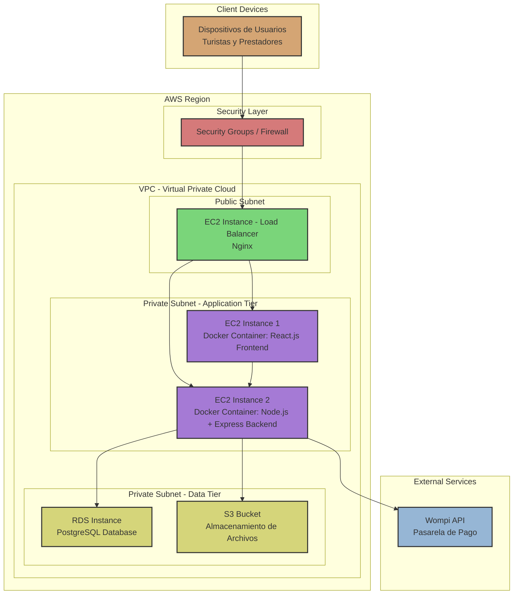

# Punto 1 — Catálogo Tecnológico

## Componentes tecnológicos de la solución

| Componente | Función | Tecnología seleccionada |
|------------|----------|-------------------------|
| **Frontend** | Interfaz web utilizada por turistas y prestadores de servicios. | React.js |
| **Backend** | Gestiona la lógica del negocio y la comunicación entre componentes. | Node.js + Express |
| **Base de Datos** | Almacena información de usuarios, prestadores, servicios y reservas. | PostgreSQL |
| **Servidor Web** | Publica la aplicación y gestiona las solicitudes HTTP. | Nginx |
| **Firewall** | Protege la infraestructura frente a accesos no autorizados. | Firewall Cloud / Security Groups |
| **Balanceador de Carga** | Distribuye las solicitudes de los usuarios entre los servicios disponibles. | Nginx Load Balancer |
| **Infraestructura Cloud** | Aloja los servicios y permite el crecimiento de la plataforma. | AWS EC2 |
| **Almacenamiento** | Guarda imágenes y archivos relacionados con los servicios turísticos. | AWS S3 |
| **Autenticación** | Gestiona el acceso seguro de los usuarios. | JWT |
| **Pasarela de Pago** | Procesa las transacciones realizadas por los usuarios. | Wompi |

# Punto 2 – Diagrama Tecnológico

## Diagrama Tecnológico

## Explicación del Diagrama

Los turistas y prestadores de servicios acceden a la plataforma a través de Internet. Antes de llegar a la aplicación, las solicitudes pasan por un firewall que ayuda a proteger el sistema contra accesos no autorizados.

Posteriormente, un balanceador de carga basado en Nginx distribuye las solicitudes para mejorar el rendimiento y la disponibilidad de la plataforma.

Dentro de la infraestructura cloud de AWS EC2 se encuentran los principales componentes de la solución: el servidor web Nginx, el frontend desarrollado en React.js y el backend implementado con Node.js y Express.

El backend se encarga de procesar la lógica de negocio y se comunica con PostgreSQL para almacenar la información de usuarios, servicios y reservas. Además, utiliza AWS S3 para almacenar imágenes y archivos relacionados con los servicios turísticos.

La autenticación de los usuarios se realiza mediante JWT, mientras que los pagos son procesados a través de la pasarela de pago Wompi.

# Punto 3 – Diagrama de Despliegue

## Diagrama de Despliegue

## Explicación

### Dispositivos de Usuarios
Los turistas y prestadores de servicios acceden a la plataforma a través de sus dispositivos (navegadores web, aplicaciones móviles) conectados a Internet.

### Capa de Seguridad
Las solicitudes de los usuarios pasan primero por Security Groups/Firewall que filtra el tráfico no autorizado antes de entrar a la VPC de AWS.

### AWS Region - VPC Architecture
La infraestructura se despliega en una VPC (Virtual Private Cloud) de AWS con la siguiente distribución:

#### Public Subnet
- **EC2 Instance - Load Balancer**: Instancia de EC2 con Nginx como balanceador de carga que distribuye el tráfico entrante hacia las capas de aplicación.

#### Private Subnet - Application Tier
- **EC2 Instance 1**: Ejecuta un contenedor Docker con el Frontend React.js
- **EC2 Instance 2**: Ejecuta un contenedor Docker con el Backend Node.js + Express

El uso de contenedores Docker facilita el despliegue, escalado y aislamiento de las aplicaciones.

#### Private Subnet - Data Tier
- **RDS Instance**: Instancia gestionada de PostgreSQL para almacenamiento de datos de usuarios, servicios y reservas
- **S3 Bucket**: Servicio de almacenamiento de objetos para imágenes y archivos relacionados con servicios turísticos

### Servicios Externos
- **Wompi API**: Pasarela de pago externa para procesar transacciones de manera segura

