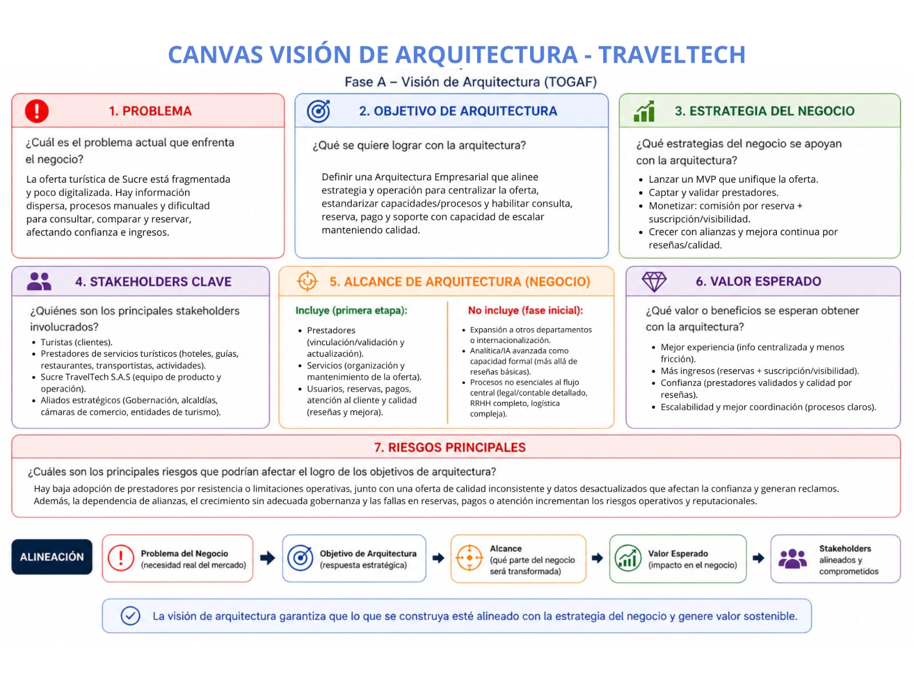

# Taller #3 - Fase de Visión y Arquitectura de Negocio (TOGAF)

### Integrantes:  
Juan Esteban Morales Peñate 
Ronal Andres Bello Ruiz 
Tomas Alfonso Madariaga Suarez 
Mateo David Villalobos Bertel
# Punto 1 - Visión de la Arquitectura (Canvas)

# Punto 2 — Arquitectura de Negocio

## Modelo de Negocio

Sucre TravelTech S.A.S funciona como un intermediario entre turistas y prestadores de servicios turísticos del departamento de Sucre. La empresa organiza y centraliza la oferta turística local, permitiendo que los usuarios puedan consultar información, comparar opciones y realizar reservas de manera más sencilla y confiable.

El modelo de ingresos se basa en comisiones por reservas realizadas dentro de la plataforma y planes de suscripción para prestadores que deseen mayor visibilidad.

---

## Capacidades de Negocio

<table>
<thead>
<tr>
<th>Capacidad</th>
<th>Descripción</th>
</tr>
</thead>
<tbody>
<tr>
<td><strong>Gestión de prestadores</strong></td>
<td>Capacidad para vincular y mantener actualizados a los prestadores de servicios turísticos.</td>
</tr>
<tr>
<td><strong>Gestión de servicios turísticos</strong></td>
<td>Capacidad para administrar la información de la oferta turística disponible.</td>
</tr>
<tr>
<td><strong>Gestión de usuarios</strong></td>
<td>Capacidad para registrar y administrar la información de los usuarios.</td>
</tr>
<tr>
<td><strong>Gestión de transacciones</strong></td>
<td>Capacidad para gestionar reservas y pagos asociados a los servicios turísticos.</td>
</tr>
<tr>
<td><strong>Gestión de experiencia del cliente</strong></td>
<td>Capacidad para atender solicitudes y brindar soporte a usuarios y prestadores.</td>
</tr>
<tr>
<td><strong>Gestión de calidad</strong></td>
<td>Capacidad para evaluar y mejorar continuamente la calidad de los servicios ofrecidos.</td>
</tr>
<tr>
<td><strong>Escalabilidad del negocio</strong></td>
<td>Capacidad para aumentar la cantidad de usuarios y prestadores sin afectar la operación.</td>
</tr>
</tbody>
</table>

---

## Procesos Principales

<table>
<thead>
<tr>
<th>Proceso</th>
<th>Descripción</th>
</tr>
</thead>
<tbody>
<tr>
<td><strong>Gestión de prestadores</strong></td>
<td>Vinculación y validación de prestadores turísticos dentro de la plataforma.</td>
</tr>
<tr>
<td><strong>Gestión de servicios turísticos</strong></td>
<td>Organización y actualización de los servicios disponibles.</td>
</tr>
<tr>
<td><strong>Gestión de usuarios</strong></td>
<td>Registro y administración de usuarios de la plataforma.</td>
</tr>
<tr>
<td><strong>Gestión de reservas</strong></td>
<td>Proceso mediante el cual el turista asegura un servicio turístico.</td>
</tr>
<tr>
<td><strong>Gestión de pagos</strong></td>
<td>Manejo de transacciones relacionadas con reservas.</td>
</tr>
<tr>
<td><strong>Atención al cliente</strong></td>
<td>Resolución de dudas, solicitudes e inconvenientes.</td>
</tr>
<tr>
<td><strong>Gestión de calidad</strong></td>
<td>Seguimiento de reseñas y evaluaciones de los usuarios.</td>
</tr>
</tbody>
</table>

---

## Estructura Organizacional

<table>
<thead>
<tr>
<th>Rol</th>
<th>Responsabilidad</th>
</tr>
</thead>
<tbody>
<tr>
<td><strong>Product Owner</strong></td>
<td>Define prioridades del negocio y valida que el producto se mantenga alineado con la estrategia.</td>
</tr>
<tr>
<td><strong>FrontEnd</strong></td>
<td>Diseña la experiencia e interacción del usuario dentro de la plataforma.</td>
</tr>
<tr>
<td><strong>BackEnd</strong></td>
<td>Gestiona la lógica operativa relacionada con usuarios, reservas y servicios.</td>
</tr>
<tr>
<td><strong>Ingeniero de Datos</strong></td>
<td>Analiza información y apoya la mejora de la experiencia del usuario.</td>
</tr>
</tbody>
</table>

---

## Servicios del Negocio

<table>
<thead>
<tr>
<th>Servicio</th>
<th>Descripción</th>
</tr>
</thead>
<tbody>
<tr>
<td><strong>Consulta de servicios turísticos</strong></td>
<td>Permite a los turistas explorar la oferta disponible.</td>
</tr>
<tr>
<td><strong>Reserva de servicios</strong></td>
<td>Permite asegurar hospedajes, actividades o transporte.</td>
</tr>
<tr>
<td><strong>Gestión de pagos</strong></td>
<td>Facilita el pago asociado a las reservas realizadas.</td>
</tr>
<tr>
<td><strong>Atención al cliente</strong></td>
<td>Brinda soporte a usuarios y prestadores.</td>
</tr>
<tr>
<td><strong>Gestión de reseñas</strong></td>
<td>Permite evaluar la calidad de los servicios ofrecidos.</td>
</tr>
</tbody>
</table>

---

# Punto 3 — AS-IS vs TO-BE

## Comparación entre estado actual y estado futuro

<table>
<thead>
<tr>
<th>Aspecto</th>
<th>AS-IS (Estado actual)</th>
<th>TO-BE (Estado futuro)</th>
</tr>
</thead>
<tbody>
<tr>
<td><strong>Procesos</strong></td>
<td>Los servicios turísticos funcionan de manera aislada y muchos procesos son manuales.</td>
<td>Los servicios turísticos estarán organizados e integrados dentro de un mismo ecosistema.</td>
</tr>
<tr>
<td><strong>Información</strong></td>
<td>La información turística está dispersa y en muchos casos desactualizada.</td>
<td>La información estará centralizada, organizada y disponible para los usuarios.</td>
</tr>
<tr>
<td><strong>Reservas</strong></td>
<td>Muchas reservas se realizan por llamadas o mensajes informales.</td>
<td>Las reservas podrán realizarse directamente dentro de la plataforma.</td>
</tr>
<tr>
<td><strong>Pagos</strong></td>
<td>Los pagos dependen de acuerdos individuales entre usuarios y prestadores.</td>
<td>Los pagos estarán organizados dentro del flujo de operación del negocio.</td>
</tr>
<tr>
<td><strong>Toma de decisiones</strong></td>
<td>Los prestadores toman decisiones con poca información sobre usuarios y demanda.</td>
<td>La empresa podrá analizar información para mejorar la oferta y la experiencia del usuario.</td>
</tr>
<tr>
<td><strong>Experiencia del usuario</strong></td>
<td>El turista enfrenta dificultad para encontrar servicios confiables en un solo lugar.</td>
<td>El usuario tendrá una experiencia más organizada y confiable.</td>
</tr>
</tbody>
</table>

---

# Punto 4 — Análisis Crítico

## Importancia de la Arquitectura Empresarial

Si la organización no define una Arquitectura Empresarial, el negocio podría crecer de manera desordenada, generando problemas de coordinación entre procesos, actores y servicios.

Además, podrían existir inconsistencias en la información, dificultades para mantener la calidad de los servicios y problemas para escalar la operación a medida que aumente el número de usuarios y prestadores.

La falta de una estructura clara también afectaría la toma de decisiones y la capacidad de mantener una experiencia confiable para los turistas y prestadores de servicios.